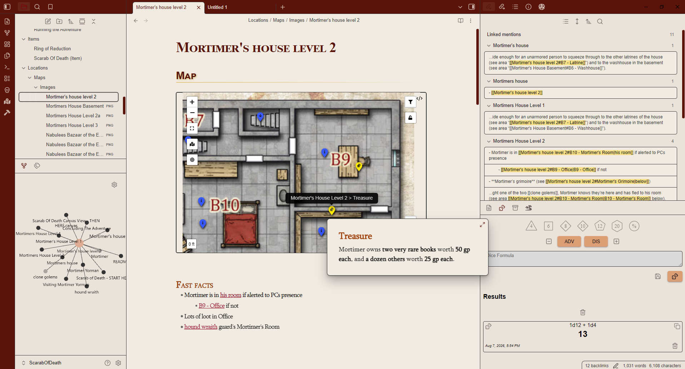

# - Adventurer 

Designed to reflect the design choices of popular tabletop adventure formats, Adventurer integrates beautifully with maps and PDFs to make running and documenting your next tabletop game easy and fun. 

# Todo
*Still need to finish some stuff*
- [x] dark mode
- [ ] Move common things to `body` and out of `.dark-mode`, etc
- [ ] fix collapsed ribbon color in dark mode
- [ ] check callouts
- [ ] "Dark" mode should be base theme and make a darker theme from the Canvas pallette?
- [ ] document palettes
- [ ] Fix extraneous text and icons 
	- [ ] settings menu titlebar
	- [ ] close/expand/minimize buttons
# Screenshots
## Light Mode

## Dark Mode

## Canvas

